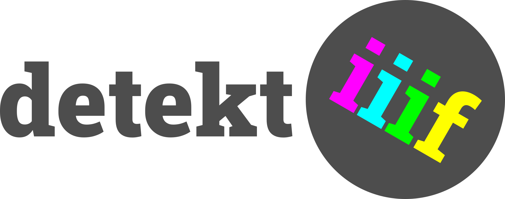

# detektIIIF2

This is the current version of detektIIIF2 (Version 1: https://github.com/leanderseige/detektiiif)

If you don't want to work with the source code you may install detektIIIF2 from the Chrome Web Store: https://chrome.google.com/webstore/detail/detektiiif-2/aaodcobgcadinjipaocibamdfcffpcpp

## Source Code

used boilerplate: https://github.com/lxieyang/chrome-extension-boilerplate-react

### Install basics:
* clone this repo ```git clone https://github.com/seigedigital/detektiiif2```
* ```cd detektiiif2```
* ```npm install```

### Configure repository

* Configure theme:
* ```cd src/themes```
* ```./settheme.sh <themefolder> <manifestversion>```
* e.g. ```./settheme.sh detektiiif2 v2```

### Run development server (version MUST match manifest version of the theme)

* ```npm startv3``` (continuous development mode + hot reload, manifest version 3)

OR

* ```npm startv2``` (continuous development mode + hot reload, manifest version 2)

__Load in Firefox (most likely v2):__
* open `about:debugging`
* click "This Firefox"
* click "Load temporary Add-on" and select your `build` folder (or the manifest.json file in it)

__Load in Chrome (likely v3):__
* open `chrome://extensions`
* turn the switch `Developer mode` on
* click Button `Load unpacked`
* select your `build` folder


### Build for production (version MUST match manifest version of the theme)

* ```npm run buildv3``` (one time build for production, manifest version 3)

OR

* ```npm run buildv2``` (one time build for production, manifest version 2)


## Create your own theme

Duplicate one of the folders in src/themes for your own theme
```
cp -r detektiiif2 myinstitution
```
Modify the files in the new folder as you wish and continue as described in section "Configure repository"

Don't forget to keep v2 and v3 manifest files both up to date, e.g. the version number.

## Version numbering

Beware! We distinguish the version number of detektiiif2 from the version number of the theme:

Set the version of detektiiif2 number in the ```package.json``` file

Set the version number of the theme in both ```manifest-v*.json``` files

## Packaging for the Chrome Web Store

* switch to manifest version 3 and execute the shellscript ```./pack4cws.sh```

## Packaging for the Mozilla Firefox AMO

* switch to manifest version 2 and execute the shellscript ```./pack4amo.sh```
